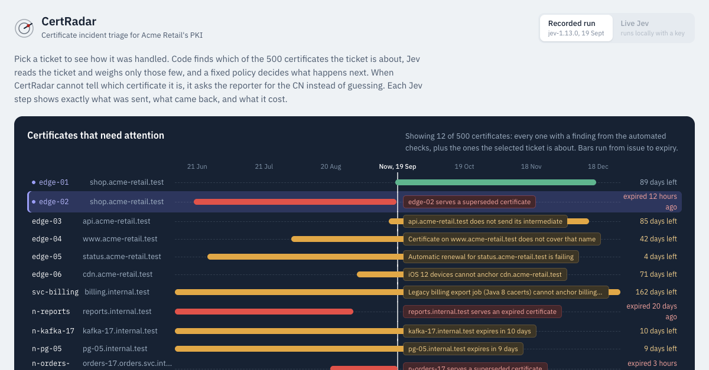
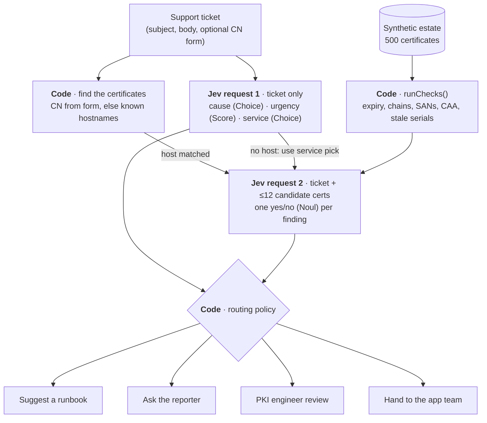

# CertRadar

**Certificate incident triage that knows which parts need judgment and which need exact code.** Built with [TypeSafe Jev](https://docs.typesafe.ai).

[**Live demo**](https://certradar-jev.mervinjones.dev) · [**Write-up**](https://mervinjones.dev/blog/certificate-triage-decision-model.html) · [Jev docs](https://docs.typesafe.ai)



Support tickets about certificates are rarely precise. "We renewed it but it's still broken" could be a stale load balancer node, a missing intermediate, or nothing to do with TLS. CertRadar splits the work the way a PKI team would: **code** does everything that has an exact answer, **Jev** reads the human prose and returns calibrated probabilities, and **code** turns those probabilities into an action through an explicit, inspectable policy.

| Code does (exact) | Jev does (judgment) |
| --- | --- |
| Expiry maths against a fixed clock | Reads the ticket and picks the likely cause |
| Chain building per client, including AIA fetching and cross-signs | Rates urgency and whether the ticket is too vague to act on |
| SAN and wildcard coverage | Links the ticket to the findings that would explain it |
| CAA checks for failing ACME renewals | |
| Detecting nodes still serving a superseded serial | |
| **The routing policy**: run a runbook, ask a human, or hand off | |

## Highlights

- **10 of 14** labelled tickets handled without a human, **0 wrong automatic actions** at the default thresholds.
- **About $0.0001 per ticket**, flat whether the estate has 500 certificates or 10 million, because Jev only ever sees a handful of them.
- **Asks instead of guessing.** When it cannot tell which certificate a ticket is about, it asks the reporter for the CN, the exact error, where it fails, and since when.
- **Nothing hidden.** Every Jev call shows the exact JSON sent and received, its tokens, time, and price, and every routing rule shows as passed or failed.
- **Runs without an API key.** The demo replays a recorded run against live Jev; add a key to triage your own tickets.

## Quick start

Requires Node.js 22+.

```sh
git clone https://github.com/mervin008/certradar.git
cd certradar
npm install
npm run dev          # http://localhost:5174
```

Without an API key the app replays the recorded Jev answers in `data/recorded.json`. To call Jev live, copy `.env.example` to `.env`, set `TYPESAFE_API_KEY`, restart, and choose **Live Jev**. Live mode also lets you write your own tickets. The key stays on the server.

## How a ticket is triaged



The estate has 500 synthetic certificates (a seeded generator adds regional storefronts, internal tools, Kafka and Postgres nodes, and hundreds of short-lived mTLS pod certificates around the hand-written scenarios). Jev never sees that inventory.

1. **Code checks the estate.** `runChecks()` in `src/pki.ts` finds expired and expiring certificates, nodes serving a superseded serial, missing intermediates, untrusted roots, SAN mismatches, and CAA-blocked renewals. It finds 11 problems in the 500 certificates.
2. **Code finds the certificates the ticket is about.** A CN typed into the intake form wins; otherwise any known hostname in the ticket text. The lookup is exact (CN, SANs, wildcards, and every endpoint serving that host).
3. **Jev reads the ticket**, with no certificates and no findings: the likely cause (Choice), urgency (Score), and which of 33 services it is about (Choice). The service pick is used only when the ticket names no host.
4. **Jev matches the evidence**, seeing only the matched certificates (at most 12) and their findings: one yes/no question per finding. When the candidates are known up front this runs in parallel with step 3; otherwise it waits for the service pick.
5. **Code applies the policy.** If CertRadar cannot tell which certificate the ticket is about (no host, an unsure service pick, or more than 12 matches), it **asks the reporter** for the CN, the exact error, where it fails, and since when, then triages again. A runbook is offered only when Jev's reading and the evidence agree and clear their thresholds.

Because Jev only ever sees a handful of certificates, the cost per ticket does not grow with the inventory: about $0.0001 whether the estate has 500 certificates or 10 million. Sample tickets are triaged with their evaluation labels stripped; a test guards this.

### The routing policy

`route()` in `src/pki.ts` checks these rules in order and stops at the first failure:

| Rule | Default threshold | If it fails |
| --- | --- | --- |
| Is it a certificate problem? | Cause `not_certificate` at ≥ 60% and no finding linked at ≥ 50% | Hand to the owning application team |
| Do we know which certificate it is about? | Host matched, or service pick ≥ 60%, and ≤ 12 candidates | Ask the reporter |
| Is Jev confident about the cause? | Cause confidence ≥ 60% | PKI engineer review |
| Does a finding explain the ticket? | Strongest finding link ≥ 50% | PKI engineer review |
| Do the ticket reading and the evidence agree? | Finding type compatible with the cause | PKI engineer review |
| All pass | | Suggest the matching runbook step |

The thresholds live in `defaultPolicy` and can be moved with sliders in the evaluation panel, which recomputes accuracy and wrong automatic actions instantly.

## What a viewer sees

Each ticket is explained in four numbered steps: finding the certificates (code), Jev reading the ticket, Jev matching the evidence, and the routing policy (code), with every rule shown as passed or failed. When CertRadar asks the reporter, live mode shows the questions as a form; the recorded run links to the follow-up.

- **Exact input and output.** Each Jev step opens to show the JSON sent to `POST /v1/systemone` and the JSON that came back, as recorded. The API key stays on the server.
- **Cost.** Every decision shows its input tokens, output tokens, time, and price. Jev bills input tokens only, at $0.042 per million for `jev-1.13.0` ([published pricing](https://docs.typesafe.ai/models)); the table lives in `src/pki.ts` and an unknown model shows "price not listed" rather than a guess. The two requests run in parallel, and a small timing chart shows the overlap.
- **Evaluation.** Accuracy, wrong automatic actions, and run cost for all labelled tickets, recomputed instantly when a threshold slider moves.

## Results

Recorded with `jev-1.13.0` on 19 September 2026 (`data/recorded.json`), 14 labelled tickets including two follow-ups where the reporter answered CertRadar's questions:

- 10 of 14 handled without a human and 0 wrong automatic actions at the default thresholds.
- Code matched the host directly on 7 tickets. On 5 that named no host, Jev picked the service: "Android app" to the public API, "status page", "Northwind" to the partner integration, "old iPhones, images" to the CDN, and "payments pods, order service" to the Order service.
- The Order service has 81 certificates, so CertRadar asked for the exact CN instead of guessing. With `orders-17.orders.svc.internal.test` from the reporter, it found the pod still serving a certificate that expired 3 hours earlier, while the renewed one sat undeployed.
- The vague ticket (T-109) went back to the reporter; with the CN it was resolved to the stale load balancer node.
- Misses are visible: on T-102 Jev read "untrusted root" where the evidence says missing intermediate, and it was only 48% sure of the service, so the ticket went back to the reporter. T-108 went to a PKI engineer at 58% cause confidence.
- The whole run cost $0.0013 for 30,116 input tokens, about $0.09 per 1,000 tickets. Median time per ticket is 368 ms, as shown in the evaluation panel.

This is a small, hand-written sample, so treat it as a demo rather than a benchmark.

## Compared with an ordinary LLM

`server/baseline.ts` runs the identical pipeline on a normal LLM: same code lookup, same candidate certificates, same two stages, same question wording, same routing policy, with structured JSON output. Only the decision engine differs.

Measured on the 9 tickets that fit the baseline's free-tier quota (`npm run baseline -- gemini-3.5-flash-lite`, then `npx tsx scripts/compare.ts`):

| | Jev (`jev-1.13.0`) | Ordinary LLM (`gemini-3.5-flash-lite`) |
| --- | --- | --- |
| Routed without a human | 7 of 9 | 7 of 9 |
| Wrong automatic actions | 0 | 0 |
| Cause read correctly | 8 of 9 | 8 of 9 |
| Median time per ticket | 596 ms | 1,420 ms |
| Cost per 1,000 tickets | $0.09 | $0.94 |

Accuracy ties, and the two miss different tickets. The difference is in the probabilities: the baseline answered 1.00 to every evidence question, including "would this stale certificate cause a payments timeout?", where Jev answered 0.29. Only the baseline's own low cause confidence stopped that from becoming an action. Thresholds are only meaningful on calibrated numbers.

Caveats: 9 tickets, one run each; the baseline is a straightforward implementation with no prompt tuning; Jev used more tokens (19,981 vs 12,668 input) and is still 10x cheaper because output is free and input is ~18x cheaper. Prices in `src/pki.ts` come from the providers' published pages.

## Configuration

All settings are environment variables, read from `.env` if present. Start from `.env.example`. Never commit `.env`; it is ignored by Git and by Vercel.

| Variable | Default | Purpose |
| --- | --- | --- |
| `TYPESAFE_API_KEY` | *(empty)* | Enables live Jev. Without it the app runs in recorded mode only. |
| `TYPESAFE_MODEL` | `jev-latest` | Model alias or pinned version, for example `jev-1.13.0`. |
| `PORT` | `5174` | Server port. |
| `HOST` | `127.0.0.1` | Bind address. Set `0.0.0.0` to expose the server beyond localhost. |
| `GEMINI_API_KEY` | *(empty)* | Only for `npm run baseline`, the ordinary-LLM comparison. |

## Commands

```sh
npm run dev          # dev server with hot reload, http://localhost:5174
npm test             # PKI checks, routing policy, API boundary (mocked TypeSafe transport)
npm run build        # strict type check + production build into dist/
npm start            # serve the build and API
npm run record       # re-run all sample tickets against live Jev and update data/recorded.json
npm run baseline -- gemini-3.5-flash-lite [--only T-101,T-102]   # same pipeline on an LLM, needs GEMINI_API_KEY
npx tsx scripts/compare.ts                                        # Jev vs baseline table from the two data files
```

## API

The Node server exposes two endpoints. Both reject cross-origin requests and are never cached.

| Endpoint | Description |
| --- | --- |
| `GET /api/config` | `{ "live": boolean, "model": string }`: whether live Jev is configured, and which model. |
| `POST /api/triage` | Triages one ticket against live Jev. Returns `503` when no API key is set. |

```json
{
  "ticket": {
    "subject": "Android app can't connect since this morning",
    "body": "Users on Android get a certificate error, iOS is fine.",
    "reporter": "Mobile team",
    "details": { "cn": "api.acme-retail.test", "client": "Android 7", "since": "08:00" }
  }
}
```

`subject` (≤ 160 chars) and `body` (≤ 2,000 chars) are required; `reporter` and the `details` fields (`cn`, `error`, `client`, `since`) are optional. The server copies only these fields before anything reaches the model, caps request bodies at 8 KB, and allows 30 triages per minute with at most 3 in flight. It is a demo server, not a multi-tenant service.

## Project layout

```text
src/
  pki.ts            synthetic estate, runChecks(), certificate lookup, route() policy, grading, prices
  App.tsx           the UI: tickets, four-step explanation, evaluation panel
server/
  triage.ts         the two Jev requests (symptoms, evidence) and answer validation
  baseline.ts       the same pipeline on an ordinary LLM, for comparison
  app.ts            Express API: /api/config, /api/triage, origin check, rate limit
  index.ts          dev (Vite middleware) and production server entry
scripts/            record.ts, baseline.ts, compare.ts (re-record and compare runs)
data/
  recorded.json     recorded Jev run that the demo replays
  baseline.json     recorded ordinary-LLM run
tests/              vitest: PKI checks and policy, API boundary
```

## Deploying

The hosted demo is a static Vite build on Vercel (`vercel.json`): it serves the recorded run only, and live mode never appears there. `.vercelignore` keeps `.env` files, `node_modules`, `dist`, and drafts out of the upload. To offer live triage, run the Node server (`npm run build && npm start`) somewhere the API key can stay server-side.

## Limits

- All data is synthetic. Nothing parses real certificates or contacts real hosts.
- Thresholds are defaults to evaluate, not tuned values.
- Model output is typed and validated, but typed does not mean correct. Every automatic action in this demo is a suggested runbook step, never executed.

## Related

- [CertPilot](https://github.com/certpilot/certpilot): open-source PKI and certificate lifecycle management.
- [TypeSafe docs](https://docs.typesafe.ai): Jev, the System One API, and model pricing.
